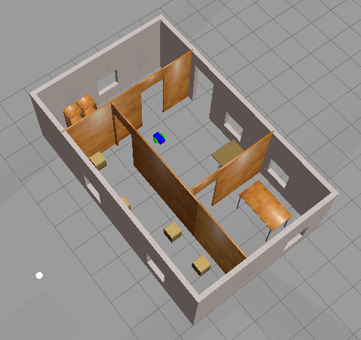

# Project 1 - Building My World - Gazebo

## Output


## Softwares Used
1. Gazebo 9 - Downloaded [from](https://www.theconstructsim.com/all-about-gazebo-9-with-ros/)

## Directory Structure
```
    .project1                           # myrobot lab main folder 
    ├── picture                         # Code output image                   
    │   ├── world.png
    ├── model                          # Model files of the two-wheeled robot
    │   ├── myrobot
    │   │   ├── model.config
    │   │   ├── model.sdf
    |   ├── mybuilding
    │   │   ├── model.config
    │   │   ├── model.sdf
    ├── script                         # Gazebo World plugin C++ script      
    │   ├── welcome.cpp
    ├── world                          # Gazebo main World empty scene
    │   ├── myworld
    │   ├── myworld_gazeb7.world
    ├── CMakeLists.txt                 # Link libraries 
    └──                              
```

## Steps to launch the simulation

```sh
$ cd /home/workspace/
$ git clone https://github.com/rtkartista/robond_projects project1
$ cd /home/workspace/project1/
$ mkdir build
$ cd build/
$ cmake ..
$ make
$ export GAZEBO_PLUGIN_PATH=${GAZEBO_PLUGIN_PATH}:/path/to/build
$ cd /home/workspace/project1/world/
$ gazebo myworld
```

## Project Description

The project includes below sections to learn gazebo7 simulation software

1. Built a single floor wall structure using the Building Editor tool in Gazebo. At least one feature, one color, and optionally one texture to your structure is applied. Made sure there's enough space between the walls for a robot to navigate.

2. Modeled any object of your choice using the Model Editor tool in Gazebo, with model links connected with joints.

3. Imported your structure and two instances of the model inside an empty Gazebo World.

4. Imported at least one model from the Gazebo online library and implemented it in your existing Gazebo world.

5. Write a C++ World Plugin to interact with your world and include it in the launch file. The code should display “Welcome to RItika Avadhanula’s World!” message as soon as you launch the Gazebo world file.
