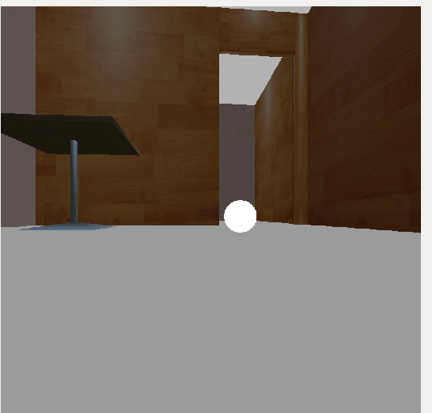

# Project 2 - Chase It - ROS+Gazebo

## Output




## Softwares Used
1. Gazebo 9 - Downloaded [from](https://www.theconstructsim.com/all-about-gazebo-9-with-ros/)
2. ROS Kinetic

## Directory Structure
```
  ├── myball                     # ball model
  ├──src                          # Go Chase It Project                  
      ├── my_robot                       # my_robot package                   
      │   ├── launch                     # launch folder for launch files   
      │   │   ├── robot_description.launch
      │   │   ├── world.launch
      │   ├── meshes                     # meshes folder for sensors
      │   │   ├── hokuyo.dae
      │   ├── urdf                       # urdf folder for xarco files
      │   │   ├── my_robot.gazebo
      │   │   ├── my_robot.xacro
      │   ├── world                      # world folder for world files
      │   │   ├── <yourworld>.world
      │   ├── CMakeLists.txt             # compiler instructions
      │   ├── package.xml                # package info
      ├── ball_chaser                    # ball_chaser package                   
      │   ├── launch                     # launch folder for launch files   
      │   │   ├── ball_chaser.launch
      │   ├── src                        # source folder for C++ scripts
      │   │   ├── drive_bot.cpp
      │   │   ├── process_images.cpp
      │   ├── srv                        # service folder for ROS services
      │   │   ├── DriveToTarget.srv
      │   ├── CMakeLists.txt             # compiler instructions
      │   ├── package.xml                # package info                  
   └──                           
```

## Steps to launch the simulation

```sh
$ cd /home/workspace/
$ git clone https://github.com/rtkartista/robond_projects project1
$ cd /home/workspace/project1/
$ catkin_make
$ source devel/setup.bash
$ roslaunch my_robot world.launch
// in a new terminal (also add the ball in the world and move around)
// add a extra light source to see the white ball clearly
$ source devel/setup.bash
$ roslaunch ball_chaser ball_chaser.launch
// in a new terminal
$ source devel/setup.bash
$ rosrun rqt_image_view rqt_image_view 
```

## Project Description

The project includes below sections to learn the basics of ROS
1. Creating URDF models and including mesh files in the project
2. Using gazebo plugins to interact with the bot and the sensors attacted to it
3. Creating ROS nodes
4. Publishing and Subscribing messages from ROS topics
5. Creating ROS clients who interact with ROS services
6. Creating ROS packages inside ROS workspace

## Project Requirements Summary By Udacity

In this project, you should create two ROS packages inside your catkin_ws/src: the drive_bot and the ball_chaser. Here are the steps to design the robot, house it inside your world, and program it to chase white-colored balls:

### drive_bot:

Create a my_robot ROS package to hold your robot, the white ball, and the world.
Design a differential drive robot with the Unified Robot Description Format. Add two sensors to your robot: a lidar and a camera. Add Gazebo plugins for your robot’s differential drive, lidar, and camera. The robot you design should be significantly different from the one presented in the project lesson. Implement significant changes such as adjusting the color, wheel radius, and chassis dimensions. Or completely redesign the robot model! After all you want to impress your future employers :-D
House your robot inside the world you built in the Build My World project.
Add a white-colored ball to your Gazebo world and save a new copy of this world.
The world.launch file should launch your world with the white-colored ball and your robot.

### ball_chaser:

Create a ball_chaser ROS package to hold your C++ nodes.
Write a drive_botC++ node that will provide a ball_chaser/command_robot service to drive the robot by controlling its linear x and angular z velocities. The service should publish to the wheel joints and return back the requested velocities.
Write a process_image C++ node that reads your robot’s camera image, analyzes it to determine the presence and position of a white ball. If a white ball exists in the image, your node should request a service via a client to drive the robot towards it.
The ball_chaser.launch should run both the drive_bot and the process_image nodes.

## The robot designed in this project will be used as a base model for all other projects


