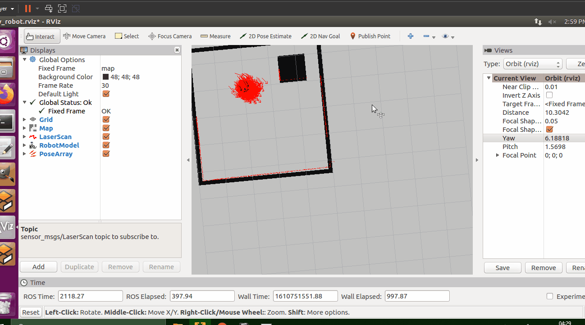
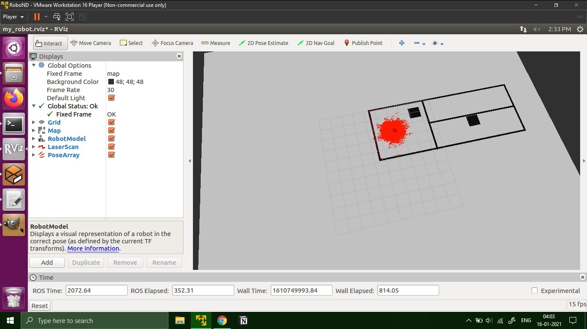
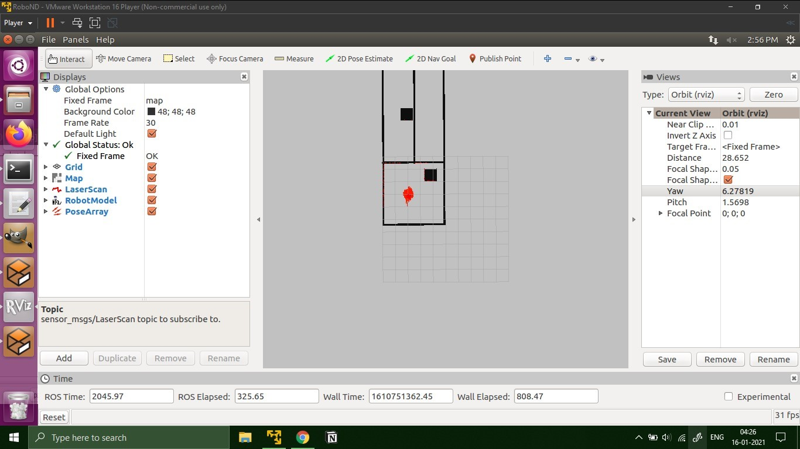

# Project 3 - Where am I

## Output







## Softwares Used
1. Gazebo 7
2. ROS Kinetic
External dependencies are downloaded using the following commands
```
sudo apt-get install ros-kinetic-navigation
sudo apt-get install ros-kinetic-map-server
sudo apt-get install ros-kinetic-move-base
sudo apt-get install ros-kinetic-amcl
```
## Steps to launch the simulation
```sh
$ cd /home/workspace/
$ git clone https://github.com/rtkartista/robond_projects project3
$ cd /home/workspace/project3/Where_am_I
$ catkin_make
$ source devel/setup.bash
$ roslaunch my_robot world.launch
```
in a new terminal
```
$ source devel/setup.bash
$ roslaunch my_robot  amcl.launch
```

## Project Description

1. A map of the world from project-1 is created using pgm-map-creator. I have then edited the image in gimp to place the robot and the map parallely.
2. In the maps folder of the package, add the map.pgm file. Additionally add an map.ymal doc which includes the details of the image map.pmg
3. In the project two launch files were created namely 'world.launch' & 'amcl.launch'
4. In the 'amcl.launch', there are three nodes added namely: 'map_server', 'amcl' & 'move_base' with additional paramaters
5. From the 'world.launch', the robot is launched, rviz is launch and the added config files downloaded from
'wget https://s3-us-west-1.amazonaws.com/udacity-robotics/Resource/where_am_i/config.zip'
helps in transformation from robot base frame to map global frame.

