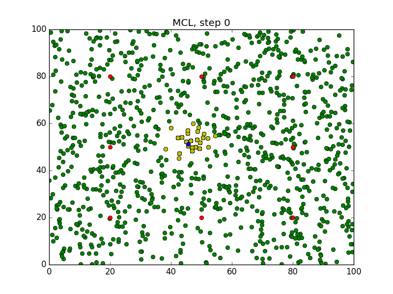
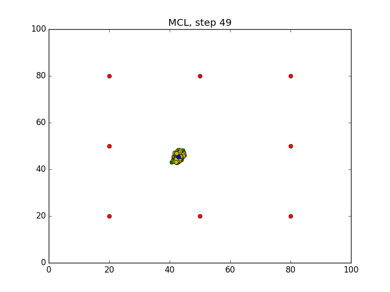

# RoboND-MCL-Lab
### Assignment
To observe the `Monte Carlo Localization` in action through the generated images using matplotlib in C++. 


### Compiling the Program
```
$ git clone https://github.com/rtkartista/Robotics_ND_Udacity.git
$ cd /home/workspace/rse/p3/exercise3
$ cd RoboND-MCL-Lab/
$ mkdir build && cd build
$ cmake .. && make
$ ./MCL
```
### Output
Initial Estimate,



After waiting for the program to iterate `50` times,



### Steps Involed in the Assignment Simulation
Initially, the assignment was cloned from Udacity's portal.

1. Step 1: 
* Print "I am ready for coding the MCL!"

2. Step 2:
* Instantiate object from Robot Class
* Set and print robot's new position
* Rotate and move robot forward. Then print out the new location
* Print the distanc of the robot from all the 8 landmarks

3. Step 3:
* Adding noise to robot's pose and sensor measurement

4. Step 4:
* Generate 1000 particles by uniformly and randomly spreading them in the 2D map.
* Added noise to the pose and sensor values 

5. Step 5:
* Creating a new particle set
* moving the new particle set and assigning them to previous particle set

6. Step 6:
* assign weights to the Robot particles based on the sensor mesurement

7. Step 7:
* Use the resampling wheel algorithm 
* binary search - nlog(n) - Roulette Wheel
* systematic resampling - linear
* resampling wheel algorithm - https://www.youtube.com/watch?v=wNQVo6uOgYA

8. Step 8:
* Evaluating the error between the resampled value and the robot position
